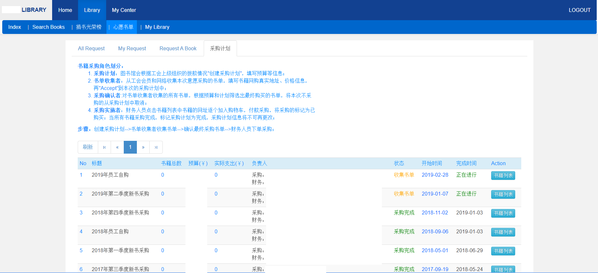

# onelibrary
A library for small company and organization. Include function:
- Book management
- Borrow, notify and fine management
- Book purchasing and plan management
- Librarian and volunteer management
- Librarian on-duty arrangement
- Email and calendar system

Write by PHP Yii 1.1 and bootstrap. Used since 2014 in Nokia.

Contact hebihong@163.com when you need more help.

NOTE: Usually this repo will not add new features anymore, please follow new version Onelibrary-Pro: https://github.com/onecmd/onelibrary-pro

## Usage

### Build
It run as a docker container, build a docker image at first.
Run command to build the docker image:
```
cd ./docker
sh ./build.sh

docker images
```

### Run and start
Run as a docker container by command:
```
cd ./docker
sh ./run.sh start
```

### Stop
Run command:
```
cd ./docker
sh ./run.sh stop
```

### Restart
Run command:
```
cd ./docker
sh ./run.sh restart
```

## Dashboard

### Dashboard


### Login


## Book management

### Book search and view for user
- Book search and view for user


- Book borrow history


- Fine list


### Book search, list, edit for librarian


### Add new book for librarian


## Book purchasing

### Submit book request


### Purchasing plan management
- Purchasing plan request


- Purchasing plan


- Purchasing plan admin


## Librarian and volunteer management

### Add, edit, delete librarian and volunteer, and role management


## Librarian on-duty arrangement

###  Duty arrangement


### Duty calendar
It can send calendar email to on-duty librarian.

